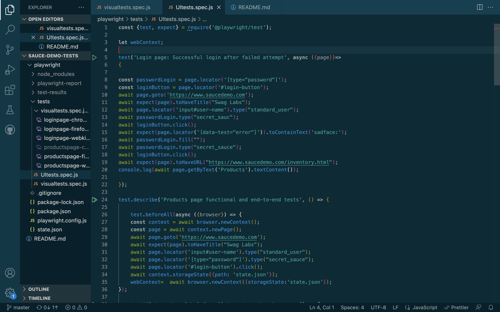
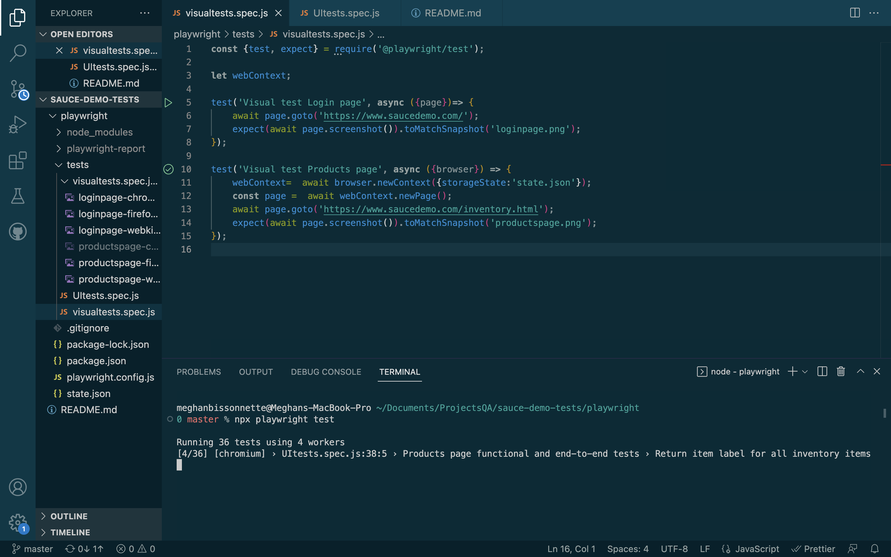
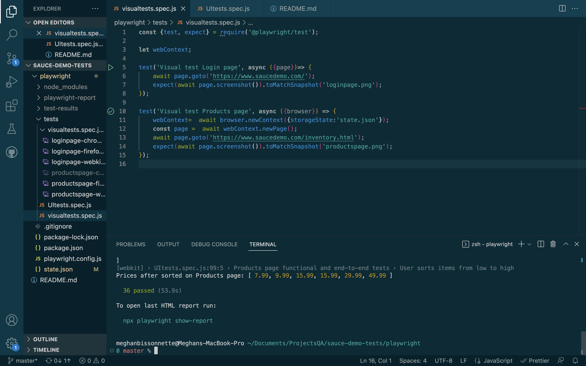
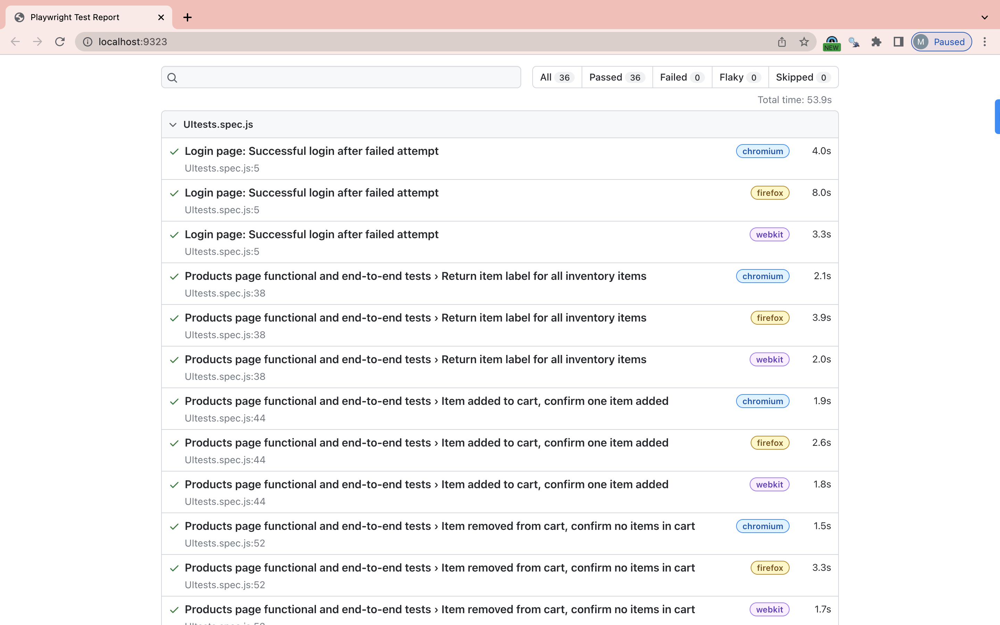

# Swag Labs Automated Tests
### Web automation testing project with functional, end-to-end, and visual UI tests using Playwright

## About
This project consists of a suite of functional, end-to-end, and visual UI web automation tests using the [Playwright framework](https://playwright.dev/) and [saucedemo.com](https://www.saucedemo.com) as the test web application. 

I created this to demonstrate the capabilities of Playwright for UI web automation testing. If you are learning Playwright and writing scripts in JavaScript, you can use this repository as a model for your own tests.










## Demo
A short demo of these tests can be viewed [here](https://youtu.be/gJvFYZlOESA).

## How to Use

From the playwright folder, use the following command to run the tests in web browsers. Tests will run parallel on Chrome, Firefox, and Safari: 
```
npm run testWeb
```

To run the tests on mobile browsers, use the following command. Tests will run parallel on Mobile Chrome and Mobile Safari browsers: 
```
npm run testMobile
```

If you don't have node.js installed, you will need to do that first. You may also be prompted to install Playwright.

## Troubleshooting and Contact

Comments, questions? Send me an email [bissonnette.meghan@gmail.com](mailto:bissonnette.meghan@gmail.com)

